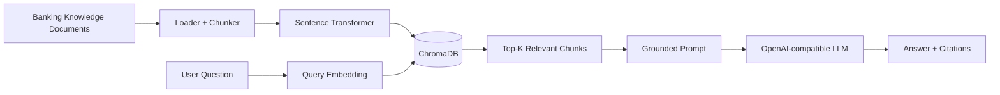

# Banking Knowledge Assistant — GenAI + RAG

A simple-to-intermediate portfolio project that demonstrates how to build a grounded banking knowledge assistant using **Retrieval-Augmented Generation (RAG)**.

The project uses synthetic banking knowledge documents, semantic chunking, sentence-transformer embeddings, ChromaDB vector search, and an OpenAI-compatible LLM. It is deliberately small enough to understand end-to-end while covering the core concepts expected in a real GenAI engineering project.

## Business problem

Bank employees and customers often need quick answers to questions about account types, cards, payments, digital banking, loans, and security. A traditional keyword search can return documents but does not synthesize an answer. An LLM alone can answer fluently but may hallucinate.

This project combines retrieval with generation so the answer is grounded in the indexed banking knowledge base.

## Architecture



See [`docs/architecture.md`](docs/architecture.md) for the detailed flow and Azure production mapping.

## Key GenAI concepts demonstrated

- RAG architecture
- Document ingestion
- Semantic/section-based chunking
- Embeddings
- Vector database
- Similarity search
- Top-K retrieval
- Metadata and source traceability
- Prompt grounding
- Source citations
- Hallucination reduction
- Optional conversational extension point
- OpenAI-compatible LLM integration

## Repository structure

```text
banking-rag-knowledge-assistant/
├── data/
│   └── documents/              # Synthetic banking knowledge
├── docs/
│   ├── architecture.md
│   └── interview_questions.md
├── notebooks/
│   └── 01_banking_rag_demo.py
├── src/
│   ├── __init__.py
│   ├── main.py
│   └── rag.py
├── tests/
│   ├── test_chunking.py
│   └── test_rag.py
├── .env.example
├── .gitignore
├── requirements.txt
└── README.md
```

## How the RAG pipeline works

### 1. Ingestion
Five synthetic Markdown documents cover account types, cards/payments, digital banking, loans, and security.

### 2. Chunking
Each Markdown document is divided into section-level chunks so retrieval works against focused pieces of knowledge instead of entire documents.

### 3. Embeddings
`sentence-transformers/all-MiniLM-L6-v2` converts each chunk into a dense vector representation.

### 4. Vector storage
ChromaDB stores the chunk text, embedding, source metadata, and a stable chunk ID.

### 5. Retrieval
A user's question is embedded and compared against the stored vectors. The nearest `TOP_K` chunks are selected.

### 6. Generation
The retrieved context is placed into a constrained prompt. The LLM is instructed to answer only from that context and cite the supporting chunks.

If `OPENAI_API_KEY` is not configured, the project still demonstrates retrieval by returning the retrieved context instead of making an LLM call.

## Setup

```bash
python -m venv .venv
```

Windows:

```bash
.venv\Scripts\activate
```

Linux/macOS:

```bash
source .venv/bin/activate
```

Install dependencies:

```bash
pip install -r requirements.txt
```

Copy `.env.example` to `.env` and add an OpenAI-compatible API key if you want generated answers.

## Run the demo

From the repository root:

```bash
python src/main.py
```

Or run the notebook-style demo:

```bash
python notebooks/01_banking_rag_demo.py
```

The first execution downloads the embedding model and creates a local `chroma_db/` directory. It is intentionally ignored by Git.

## Run tests

```bash
pytest -q
```

The unit tests validate document loading, semantic chunk creation, and expected banking topics without requiring an LLM API key.

## Example questions

- What is the difference between a savings account and a current account?
- What should I do if I see an unauthorized card transaction?
- What is an EMI?
- What is the difference between a debit card and a credit card?
- What is phishing?
- What should I know about UPI PIN safety?

## Why RAG?

| Approach | Main issue |
|---|---|
| LLM only | May hallucinate or use outdated knowledge |
| Keyword search | Retrieves documents but does not synthesize a useful answer |
| Fine-tuning | Knowledge updates require another training cycle and do not inherently provide source retrieval |
| RAG | Retrieves relevant evidence at runtime and grounds generation in that evidence |

## Data quality and safety considerations

This repository uses synthetic content and is not a source of real bank policy. A production implementation should use approved enterprise documents, document versioning, access-control metadata, PII protection, prompt-injection defenses, audit logging, and human escalation for high-impact decisions.

## Azure production mapping

| Local portfolio component | Azure-oriented production design |
|---|---|
| Markdown files | Azure Blob Storage / ADLS Gen2 |
| Sentence Transformers | Azure OpenAI embedding model or approved embedding endpoint |
| ChromaDB | Azure AI Search vector/hybrid index |
| OpenAI-compatible client | Azure OpenAI |
| `.env` | Azure Key Vault + managed identity |
| Local Python process | Azure Container Apps / Functions / AKS |
| Local logs | Azure Monitor + Application Insights |

## Production improvements

1. Add document ingestion from Blob Storage.
2. Add hybrid keyword + vector retrieval.
3. Add a reranker after initial retrieval.
4. Add document-level authorization filters.
5. Add conversation memory with explicit session boundaries.
6. Add prompt-injection and malicious-document defenses.
7. Add evaluation datasets for retrieval precision, recall, groundedness, and answer relevance.
8. Add tracing and token/cost monitoring.
9. Add automated index refresh when documents change.
10. Add human escalation for regulated or high-impact questions.

## Interview explanation

> "I built a banking knowledge assistant using RAG. During ingestion, I load domain documents, split them into semantic sections, create embeddings, and store the vectors with source metadata in ChromaDB. At query time, I embed the user's question, retrieve the most relevant chunks, and pass only that evidence to an OpenAI-compatible model. The prompt explicitly restricts the model to the retrieved context and asks it to cite the sources. This gives us a simple, explainable GenAI application where the knowledge can be updated without retraining the model. For Azure production, I would replace the local vector store with Azure AI Search, use Azure OpenAI, store documents in ADLS/Blob, protect secrets with Key Vault, and add identity-aware retrieval, evaluation, and observability."

## Next project in the portfolio

This project is intentionally the **basic RAG** implementation. The next GenAI project will extend the pattern into an **advanced Healthcare Document Assistant** with metadata filtering, query rewriting, richer retrieval controls, and more explicit grounding/evaluation.

## Disclaimer

All banking content in this repository is synthetic and created for learning, portfolio, and interview demonstration purposes only. It does not represent the policies or products of any real financial institution.
