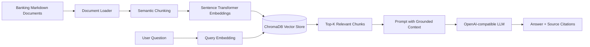

# Architecture

## RAG flow

1. Load domain documents from `data/documents`.
2. Split documents into section-level chunks.
3. Generate dense embeddings using `sentence-transformers/all-MiniLM-L6-v2`.
4. Store vectors, text, and source metadata in ChromaDB.
5. Embed the user's question and retrieve the nearest chunks.
6. Pass only retrieved context to the LLM.
7. Return an answer with source references.

## Why RAG instead of fine-tuning?

The knowledge base is external and can change independently of the model. RAG keeps the model general while grounding answers in the latest indexed documents. It is also easier to inspect the retrieved evidence and update the knowledge base without retraining the model.

## Production Azure mapping

| Portfolio component | Azure production option |
|---|---|
| Documents | Azure Blob Storage / ADLS Gen2 |
| Embeddings | Azure OpenAI embeddings or managed embedding endpoint |
| Vector store | Azure AI Search vector index |
| LLM | Azure OpenAI |
| Secrets | Azure Key Vault |
| Monitoring | Application Insights / Azure Monitor |
| Orchestration | Azure Functions / Container Apps / AKS |
